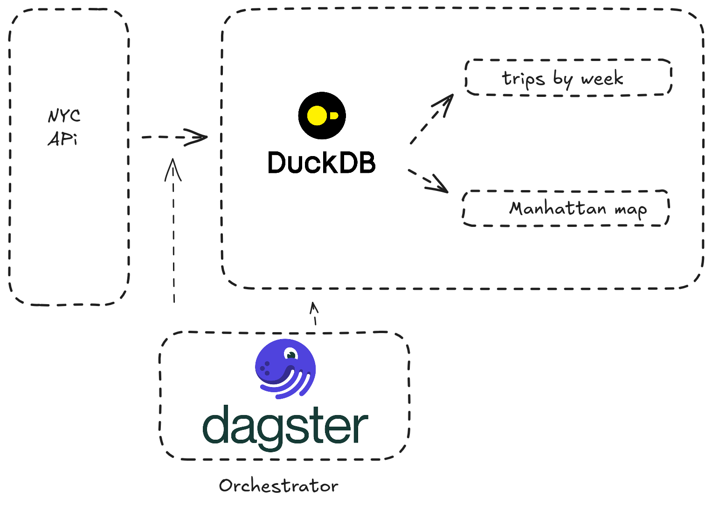
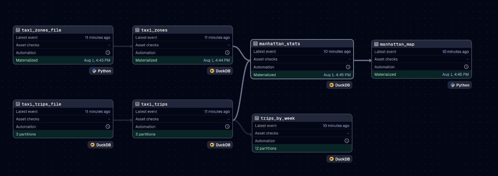
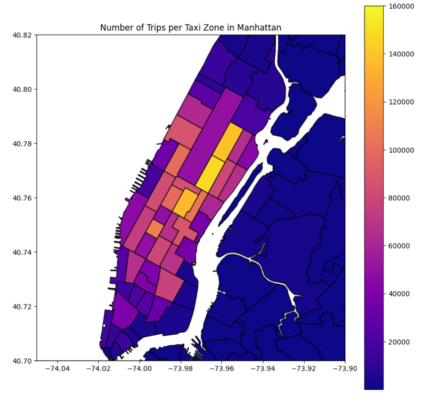

# NYC Taxi Data Pipeline with Dagster

This repository contains an ELT pipeline developed with Dagster using the NYC Taxi dataset, implementing the main data orchestration functionalities including:

1. Declarative orchestration based on Assets
2. ELT processing with DuckDB
3. Data backfill using Partitions
4. Schedule and Job configuration
5. Auto Materialization policies
6. Metrics visualization and analysis

## Installation

Clone the repository and install dependencies using uv:

```bash
git clone https://github.com/alexnt4/dagster-pipeline
cd dagster-pipeline
uv sync
```

This will automatically create the virtual environment and install all necessary dependencies.

Then, start the Dagster web server:

```bash
dg dev
```

Open http://localhost:3000 in your browser to access the Dagster interface.

## System Architecture

<div align="center">
 
</div>

The pipeline processes NYC taxi data following an ELT (Extract, Load, Transform) pattern:

- **Extraction**: Taxi trip data from source files
- **Load**: Storage in DuckDB as data warehouse
- **Transform**: Aggregations and calculated metrics
- **Visualization**: Dashboards and charts for analysis

### Main Assets

- `taxi_zones_file` / `taxi_zones`: NYC taxi zones data
- `taxi_trips_file` / `taxi_trips`: Individual trip records
- `manhattan_stats`: Manhattan-specific statistics
- `manhattan_map`: Geographic data visualization
- `trips_by_week`: Weekly aggregated temporal analysis

## Implemented Features

### Assets and Materialization

Assets represent objects in persistent storage that capture the state of data at different pipeline stages.

<div align="center">
 
</div>

### Partitions

Implementation of temporal partitioning to efficiently process historical data and enable selective backfills.

### ⏰ Schedules and Jobs

Configuration of automatic and scheduled executions to keep data up to date.

### Auto Materialization

Automatic policies that determine when to regenerate assets based on dependencies and upstream changes.

### Visualization

<div align="center">
 
</div>